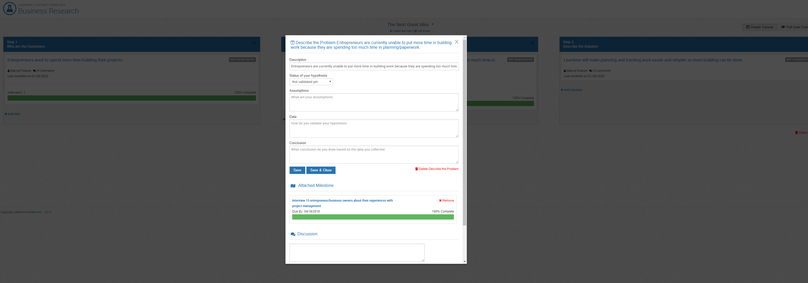
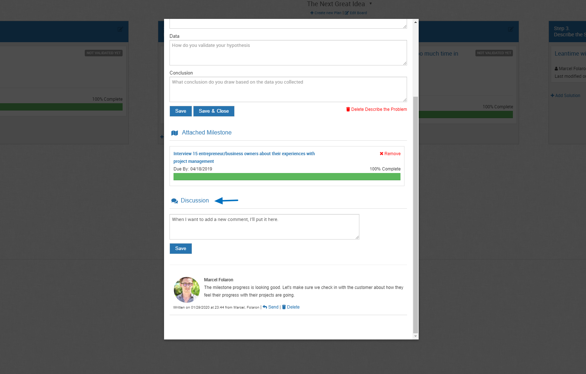

# Research Boards

The Research Board is the home for idea, project, or user testing.  When you're building, you want to be sure that you're building with purpose and that you're building something that people want, need, and are willing to pay for.  

Transparency in this area for the team is important.  It gives team members the ability to remain adaptable, hopefully predict and anticipate changes and do so while being tracked.

This is what you can expect to see when you log onto the Research Board:

There are two views here on the top right side of the boxes - the simple and the full Lean Canvas.  The highlighted text shows which board you are on.  This is the Simple View.  

This view is geared towards those ideas or projects that need some validation or proofing before and/or while tackling tasks.  It's the straightforward view that builds the groundwork for the more in depth research.  As seen above, it asks 3 primary questions:

**- Who am I building for?**  
**- What problems do they have?**   
**- What are my solutions to this problem**?

Ready to Answer?  Click *Add New*.

### The Customer

Adding a new customer will show you this screen.  This is where you put all the things you *think* you know about the customer.  

**Describe the Hypothesis about your customer --** 
Ex:  *Entrepreneurs (customer) want to spend more time building their projects.*

**Status of my hypothesis;** Not Validated, Validated and False, Validated & True.

**Assumptions**:  We’re assuming that
- Entrepreneurs feel like they do not have enough time to build projects.
- Entrepreneurs want to spend more time on projects because it saves money.
- Entrepreneurs find building more enjoyable than planning.

**Data Collection:**  How will you validate your hypothesis and assumptions?
1. Our team will interview 15 entrepreneur/business owners utilizing open ended questions on their experiences with project management. 

While we typically think we know what a solution should look like, this method of research intends for the customer to share pieces of the solution.  By collecting these data points, you can get the information needed to both validate (or invalidate) your solution and set your team up for building what your customers are looking for and already waiting for.  

This pattern will continue into Problem & Solution.  The Full Canvas will take you through this in more detail -- looking also at solution costs, revenue flows, value proposition, metrics and distribution channels.

In the end, it should look something like this:

Click *Save & Close*.

### The Problem

This section is laid out similar to The Customer and asks the same questions.

### The Solution

The pattern continues from The Customer & The Problem sections.  In these windows, you will assign text to the information, click Save & Close or Save and can also link to existing milestones or to create new ones.  

For more information on Milestones: [Roadmap Planning](using-leantime/roadmap-planning.md)

### The Little Details

All the arrows here will point to changes you can make to the board:

In this scenario, the title of our board is: *The Next Great Idea*.  The down arrow next to the name is a drop down box.  This drop down allows you to switch between multiple board titles.   
Underneath our board name is more clickable text: *Create New Board* & *Edit Board*  
*Create New Board* will allow you to start a new research board.  This new title will appear in the drop down mentioned above.  
*Edit Board* allows you to edit the name of the current board you are on.

When you've added a customer, a drag and drop box will appear.  To edit the customer, solution, or problem, you will click on the blue text.  

In the far right corner, you will find red text: *Delete Board*.  This is, as it sounds, to delete the board you are currently on.

Want to **Collaborate** on your research?

Leave a comment.

When you're all finished, it should look like this:

This is the whole of the Simple View.  The Full Lean Canvas view will offer a more in-depth research functionality.  The board usage is the same as is the boxes.  For your projects, you'll decide which categories you need and track from there.

Need more information on the Lean Methodologies and Research? Click [here](knowledge-base/whatislean.md) to read more.  
